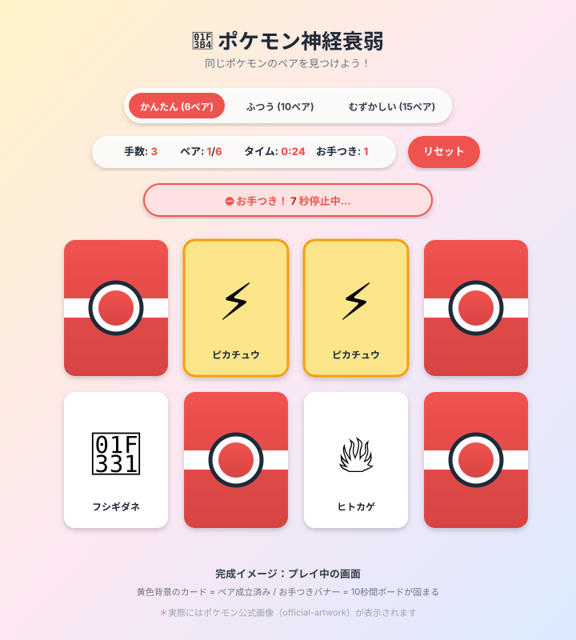
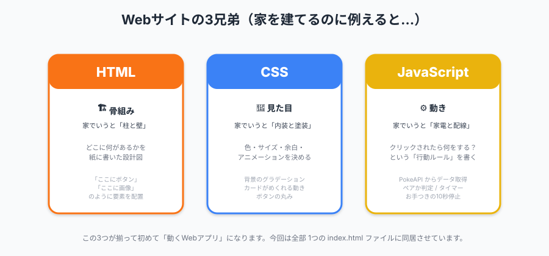
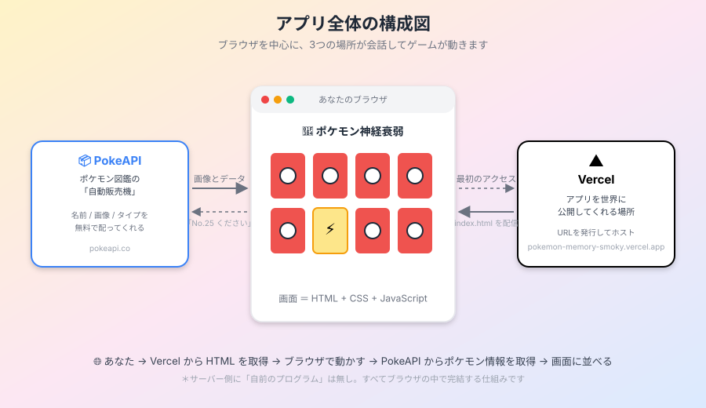
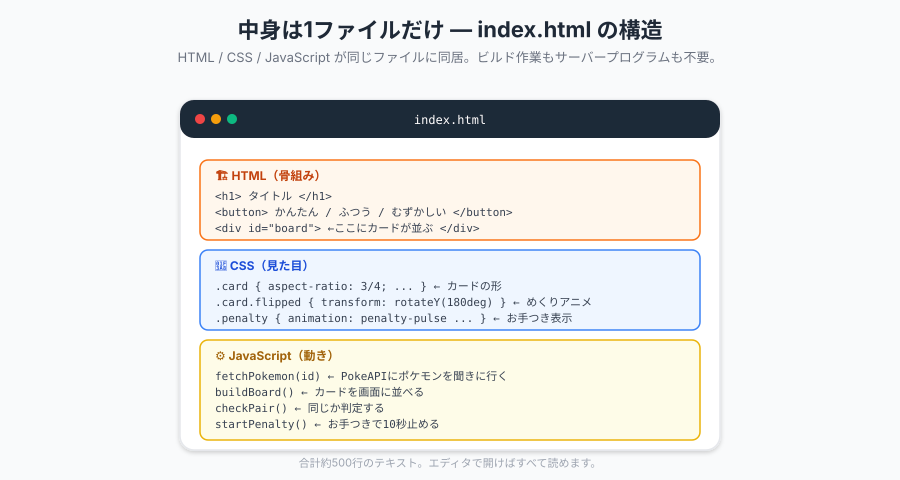
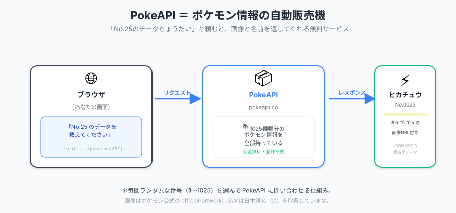
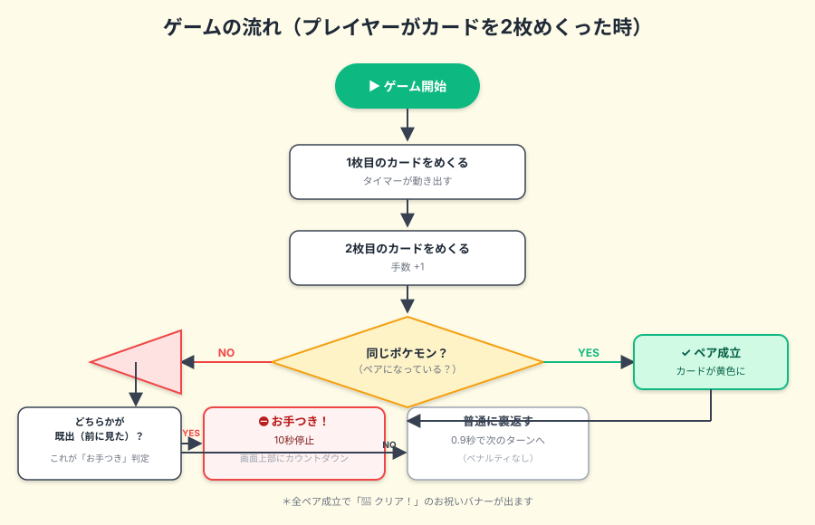
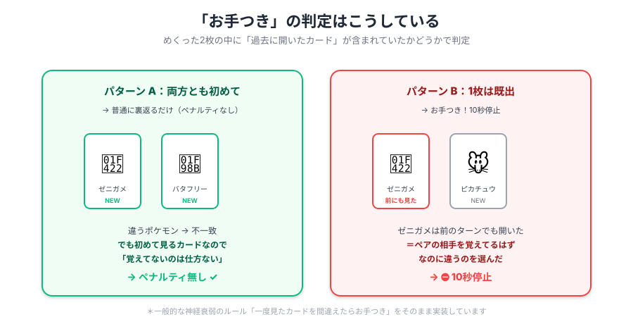
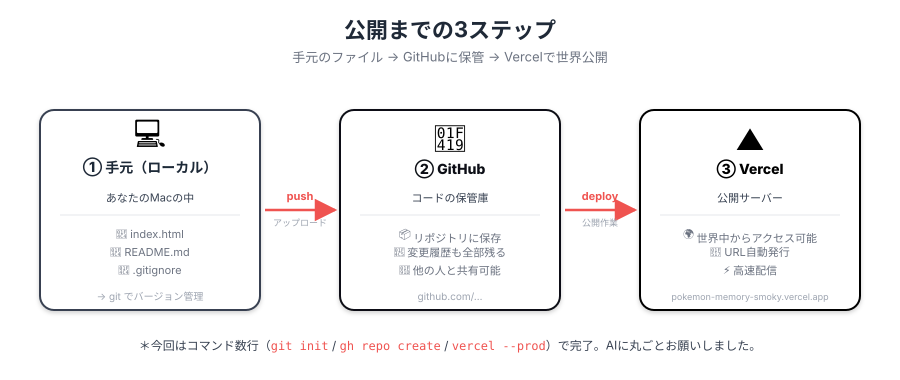

# 🎴 ポケモン神経衰弱 — このアプリはこうやって作りました

> プログラミングを書いたことがない方向けに、「中で何が起きているのか」「どうやって公開したのか」を図解つきでまとめた解説資料です。

公開URL: **https://pokemon-memory-smoky.vercel.app**

---

## 0. 完成したアプリのイメージ

カードをめくって同じポケモンのペアを見つける、おなじみの神経衰弱（メモリーマッチ）です。



操作は3つだけ。

| ボタン / 行動 | 何が起きる？ |
|---|---|
| 難易度切替（かんたん / ふつう / むずかしい） | カード枚数が変わる（12 / 20 / 30枚） |
| カードをタップ | カードがめくれる。2枚開いた時点で判定 |
| リセット | 違うポケモンで新しいゲームを開始 |

---

## 1. そもそも「Webアプリ」って何でできてるの？

家を建てる作業に例えると、Webアプリ（ブラウザで動くアプリ）は **3兄弟** が協力して作ります。



- **HTML（エイチティーエムエル）** ＝ 家の **骨組み**。「ここにボタン、ここに画像」と配置を書く言語
- **CSS（シーエスエス）** ＝ 家の **見た目**。色・形・アニメーションなどを担当
- **JavaScript（ジャバスクリプト）** ＝ 家の **動き**。「ボタンを押したら何が起こる？」というルールを書くプログラム

このアプリは、この3つが全部 **`index.html` という1つのファイル** に書かれています（500行ぐらい）。

> 💡 **補足**：1ファイルで完結しているので、ファイルをダブルクリックすればブラウザで開きます。サーバープログラム（Pythonとか）も、データベースも、ビルド作業（コードを変換する作業）も一切ありません。

---

## 2. アプリ全体の構成 — 3つの場所が会話する

ブラウザの中だけで動いているように見えるこのアプリも、実は **2つの外部サービス** とお話しています。



- **PokeAPI（ポケエーピーアイ）**  
  ポケモン情報の **無料自動販売機**。「No.25 のデータをください」と聞くと、画像URLや名前を返してくれます。
- **Vercel（ヴァーセル）**  
  作ったアプリを **世界中に公開してくれるサービス**。URLを発行して、誰でもアクセスできるようにしてくれます。

---

## 3. ファイルの中身を覗いてみる

`index.html` の中身を3つの色で塗り分けると、こんな構造になっています。



「うわ、難しそう…」と思うかもしれませんが、それぞれのブロックは **「画面のこの部分はこう作る」** という説明書のようなもの。料理のレシピと同じで、上から順に読めば何をしているかわかります。

---

## 4. ポケモンはどこから来るの？

カードに表示されるポケモンは、毎回ランダムで **PokeAPI** という外部サービスからもらってきています。



具体的な流れは：

1. ゲーム開始時、ランダムな番号（例：25, 150, 1, 487...）を選ぶ
2. 各番号について「データちょうだい」と PokeAPI にお願い
3. 名前と画像URLが返ってくる
4. それをカードに並べて、シャッフル

> 💡 **補足**：「No.25 ＝ ピカチュウ」のように、すべてのポケモンに **図鑑番号** が振られています。1〜1025番までが対象。

---

## 5. ゲームのロジック（判定の流れ）

カードを2枚めくった時、JavaScript の中ではこういう処理が走っています。



ポイントは **「お手つき」の判定** です。

---

## 6. 「お手つき」の仕組み（一般的な神経衰弱ルール）

このアプリでは、本物の神経衰弱と同じく **「一度見たカードを覚え間違えた時だけ罰則」** にしています。



- **パターン A**：両方とも初めて開くカード → ペナルティなし（覚えてないのは仕方ない）
- **パターン B**：どちらかが過去に開いたカード → **⛔ お手つき！ 10秒間ボードが固まります**

裏側では、開いたカードを「見たことがあるリスト」に記録しておき、新しい2枚をめくった時にそのリストに含まれていたかを確認しています。

---

## 7. 公開までの3ステップ

作ったアプリを「世界中の人が見られるWebサイト」にするには、3つの場所を経由します。



| ステップ | 場所 | 役割 |
|---|---|---|
| ① ローカル | Macの中 | コードを書く・動作確認する |
| ② GitHub | コードの保管庫 | 履歴を残す・共有する |
| ③ Vercel | 公開サーバー | 世界中からアクセスできるURLを発行 |

> 💡 **補足**：GitHub と Vercel はどちらも **無料アカウント** で使えます。今回のような小さなアプリなら、月額料金も発生しません。

---

## 8. 開発の進め方 — AIに丸ごとお願いした

このアプリは、すべて **Claude Code（AIコーディングアシスタント）** に話しかけながら作りました。書いたコードはほぼゼロ行。指示の内容は：

```
1. 「ポケモンのアプリを神経衰弱に作り直して、GitHubに上げてVercelで公開して」
   → 全部できた

2. 「お手つきしたら10秒停止する機能を加えて」
   → 機能追加 + 再デプロイ

3. 「2回目以降でお手つき動作をして」
   → ロジック変更 + 再デプロイ

4. 「一度開いたカードを間違えたらお手つき。一般的な概念で」
   → ロジック修正 + 再デプロイ
```

このように **「自然な日本語で会話する」** だけで、

- HTML / CSS / JavaScript の作成
- PokeAPI との連携設計
- Git でのバージョン管理
- GitHub へのアップロード
- Vercel への公開
- ロジックの仕様変更と修正

がすべて自動で進みました。コードを読まなくても、「こういう機能が欲しい」「ここを直してほしい」と伝えるだけで形になります。

---

## 9. まとめ — 専門用語ミニ辞典

最後に、この資料に出てきた言葉を簡単にまとめておきます。

| 用語 | 意味 |
|---|---|
| **HTML** | Webページの骨組みを書く言語（HyperText Markup Language の略） |
| **CSS** | Webページの見た目を整える言語（Cascading Style Sheets の略） |
| **JavaScript** | Webページに動きを付けるプログラミング言語 |
| **API**（エーピーアイ） | サービス同士が会話するための窓口。今回は PokeAPI を使った |
| **PokeAPI** | ポケモンのデータを無料で配ってくれるサービス（pokeapi.co） |
| **Git**（ギット） | ファイルの変更履歴を管理する仕組み |
| **GitHub**（ギットハブ） | Git のファイルをインターネット上に保管できるサービス |
| **Vercel**（ヴァーセル） | Webアプリを世界に公開するためのサーバーサービス |
| **デプロイ** | 作ったアプリを公開サーバーに配置する作業 |
| **ローカル** | 自分のパソコンの中、という意味 |

---

🎮 **遊んでみる**: https://pokemon-memory-smoky.vercel.app  
📦 **ソースコード**: https://github.com/YUICHI-LTVA/pokemon-memory
